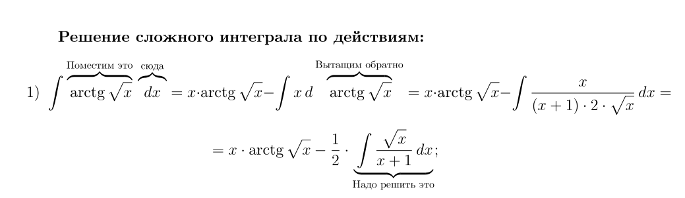
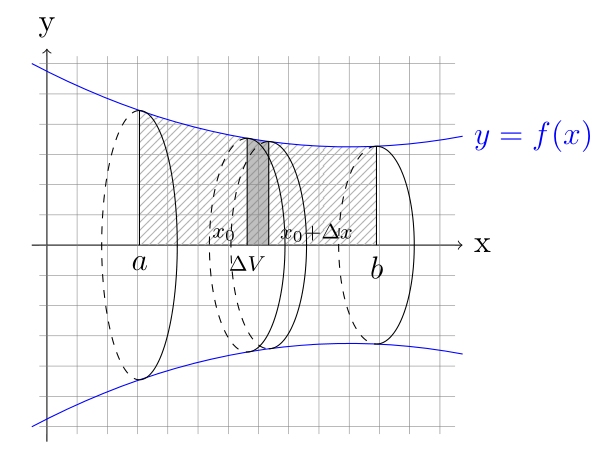
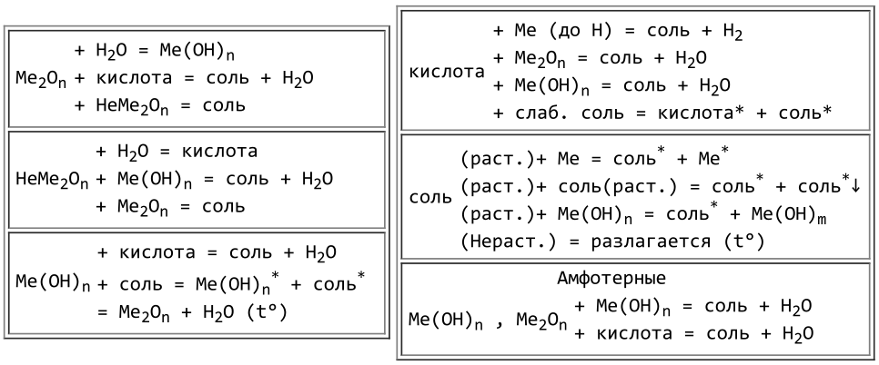

# Записи из школьных тетрадей

Есть записи самой полезной для меня информации в школе по математике и химии.

Насчёт химии не уверен, что она может быть полезна, а вот над математикой я постарался, записал самое ценное, и сделал очень клёвые иллюстрации. Вот как это выглядит:

Скачать pdf'ки можно в секции releases.

Компилировать при помощи `xelatex`.